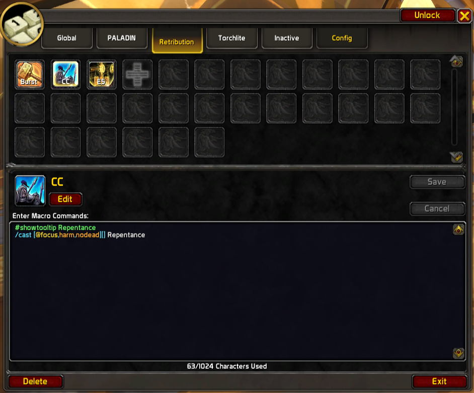

# Mega Macro (a World of Warcraft AddOn)



**IMPORTANT:** Before you use this AddOn, make sure you read the `before you use` section!

## Features

Use the `/m` command to begin your new macro experience!

Once macro import is complete, `/m` will only show the new macro UI.

### More macro slots!

This AddOn seamlessly provides you with a massive increase to macro slots over the native amounts (120 global 
and 30 per-character slots). How does it do this? By segmenting the total macro slots into categories and 
hot-switching macros based on your Class and Specialization.

The breakdown of macro slots is as follows:
1. 60 global macros
2. 30 per-class macros
3. 30 per-specialization macros
4. 30 per-character macros
5. (Legacy support for inactive/archived macros)

That's an amazing 60 slots you can use to setup your macros for each class/specialization, where previously 
you would be forced to fit all your class macros for all specializations into the limited character-specific 
slots!

### Shared macros across characters

Building on the last feature, the per-class and per-specialization macros are not character specific. 
You don't need to copy your macros around manually if you have more than one character of the same 
class—Mega Macro syncs them for you automatically.

### Improved macro icon/tooltip evaluation

This is the other big feature added by this AddOn. By default the Blizzard UI picks your icon based on
`#showtooltip` or uses the icon of the spell that will be cast. Mega Macro improves this by doing the 
following:

1. `#showtooltip` is always used as the source for icon and tooltip when present.
2. If no `#showtooltip` is present, the spell/item/toy that will be cast is dynamically evaluated to determine
   the correct icon.
4. You can set a specific fallback icon to display if no conditions are met.
5. Smart Fallback: If no spell/item/toy/icon will be used, it picks the first valid spell/item/toy found in the macro code.

Number 3 is the kicker here. This means if you are a healer and have heal-safe macros like this one:

```
/cast [help, no dead] Heal
```

You don't need to prefix your macro code with `#showtooltip Heal` —the AddOn handles that for you! This cuts down 
on redundant manual work and saves character space for functional code.

As a bonus, `castsequence` commands will not only effortlessly display the correct icon, but you'll also get 
the tooltip for the current ability in the sequence—something impossible in the default UI.

### Bigger macros!

Write macros up to 1024 characters long. No more minifying your code or using obscure abbreviations just to fit 
the limit. Spread out those casts, use separate lines for readability, and add comments. You can do so much more 
with four times the code capacity!

*(Note: Macros over 255 characters are handled via a secure clicking system invisible to the user.)*

### Ids are preserved

Your action bars will not break. Your macros defined in the Mega Macro UI are synchronized to the native macro slots, so you don't have to worry about your action bars breaking when switching characters, specializations, or uninstalling the addon.

### Improved macro UI

The Mega Macro UI replicates the native macro UI feel but adds:

* Searchable icon list (Updated for Patch 12.0)
* Wider interface, making better use of screen space
* Taller text box, so you rarely have to scroll to view code
* Buttons are contextually disabled
* "Change Name/Icon" simplified to "Rename"
* Icons in the macro list update dynamically based on conditionals

## Before you use

This AddOn will take over your existing macros once they have been imported. If the import fails, the AddOn won't do anything to your macros.

Once successfully imported, if you remove the AddOn folder without uninstalling properly, you will be left with "stub" macros (macros that point to Mega Macro logic).

To avoid this, follow the instructions below.

## How to Install
1. Install the addon to your `_retail_/Interface/AddOns` folder.
2. Login to your character.
3. The addon will automatically prompt to import your existing macros into the Mega Macro storage.

## How to Uninstall (The Easy Way)
1. Open Mega Macro (`/m`).
2. Click the Config tab at the bottom right.
3. Click the Uninstall button.
4. The addon will restore your macros to their standard Blizzard format (shortening them if necessary).
5. You can now safely delete the AddOn folder.

## How to Uninstall (The Manual "Nuclear" Way)
If you cannot access the game or the uninstall button fails, you can restore your macros if you made a backup of your WTF folder.

### When you install the AddOn (The Manual Way)

**Before you start the game**, you'll want to back up your macros. To do this:

1. Windows + R (open the run dialog)
2. Enter the following command:

```
robocopy "C:\Program Files (x86)\World of Warcraft\_retail_\WTF\Account" %USERPROFILE%\Games\wow-macro-backup macros-cache.txt /s
```

3. click OK

### When you want to remove the AddOn (The Manual Way)

Do the following steps **after exiting the game**.

1. Windows + R (open the run dialog)
2. Enter the following command:

```
xcopy /e /i /y %USERPROFILE%\Games\wow-macro-backup "C:\Program Files (x86)\World of Warcraft\_retail_\WTF\Account"
```

3. click OK

### Special Thanks

Special thanks to `aurelion314` (`Cubelicious` in-game) and `Dannez83` for their contributions during Dragonflight, and to the community for helping update the addon for Patch 12.0.0 (Midnight). This Addon is being updated with AI assistance using Gemini 3 Pro.

